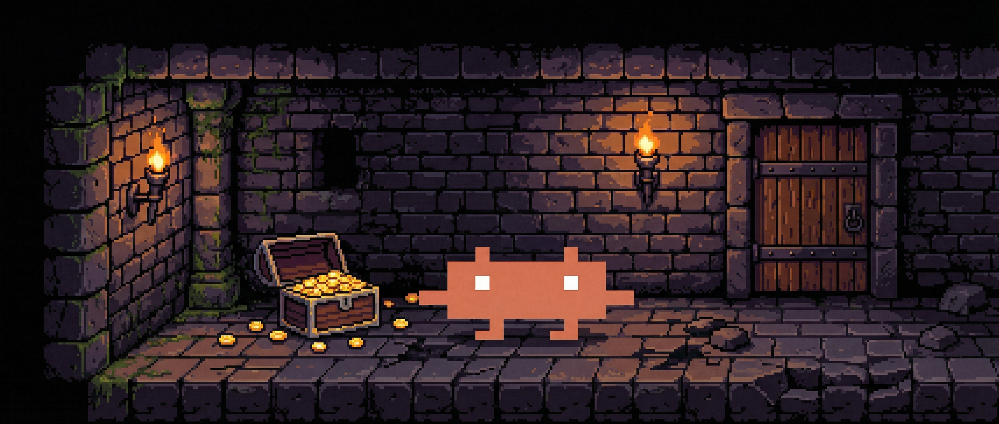

# Claude Code Hero



You know the basics. Chat, CLAUDE.md, maybe a prompt or two. But there are deeper chambers -- commands, hooks, agents, skills, plugins -- and most who wield Claude Code never find them.

This is the dungeon that teaches you how.

Ten quests. Each one builds a real artifact on your machine. The artifacts connect -- the spell you forge in Level 3 gets a tripwire in Level 6, and everything binds together in Level 9. You start at the threshold learning to talk to Claude Code. You end by building your own plugin.

The medium is the message: you learn about plugins by using one.


## Before You Enter

You'll need three things. The install script checks for all of them and offers to fetch what's missing.

```bash
git clone https://github.com/kylesnowschwartz/claude-code-hero.git
cd claude-code-hero
bash scripts/install.sh
```

| Dependency | Purpose | Install source |
|---|---|---|
| [Ruby](https://www.ruby-lang.org/en/documentation/installation/) | Runs the game engine | Homebrew / apt |
| [jq](https://jqlang.org/download/) | Parses JSON in hook scripts | Homebrew / apt |
| [Claude Code](https://docs.anthropic.com/en/docs/claude-code/getting-started) | The CLI you're here to master | Official installer |

macOS and Linux. Windows users: WSL.

## Enter the Dungeon

```bash
$ claude --plugin-dir . --agent dungeon-master
```

A guide will meet you at the entrance.

## The Ten Chambers

| Quest | Chamber | What You Learn |
|-------|---------|----------------|
| 0 | The Threshold | Basic Claude Code interaction |
| 1 | The Map Room | The `.claude/` directory |
| 2 | The Tome of First Instructions | `CLAUDE.md` |
| 3 | The Goblin Lair of Commands | Slash commands |
| 4 | The Warden's Keys | Settings and permissions |
| 5 | The Enchanted Inscription | Rules |
| 6 | The Tripwire Cavern | Hooks |
| 7 | The Skill Quest of Doom | Skills |
| 8 | The Summoner's Circle | Agents |
| 9 | The Artificer's Workshop | Plugins |

## Commands at Your Belt

| Command | What it does |
|---|---|
| `/hero-status` | Unroll the quest log |
| `/verify` | Test whether your current quest is complete |
| `/music` | Toggle dungeon music on or off |
| `/restart` | Wipe all artifacts and return to the entrance |

## How Progress Works

Your journey saves to `.claude/claude-code-hero.json`. The dungeon master verifies your work programmatically and advances you when you pass. Already have a `CLAUDE.md` or existing hooks? Never fear, only the local .claude/ directory is touched.

Left mid-quest? Walk back in anytime and resume your quest: `claude --plugin-dir . --agent dungeon-master`

## License

MIT
